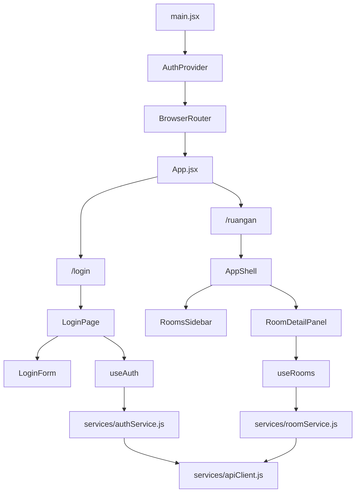

# Medeva Frontend

Frontend ini adalah aplikasi single-page berbasis React + Vite untuk mengelola login dan pengaturan kategori ruangan rawat inap di Medeva. Aplikasi memakai React Router untuk navigasi, hook custom untuk state/data flow, dan service layer terpisah untuk berkomunikasi dengan backend.

## Ringkasan

- Framework utama: React 19
- Bundler: Vite
- Routing: React Router DOM
- Styling: Tailwind CSS + CSS custom properties di `src/index.css`
- Data source: backend REST API via `fetch`
- Autentikasi: token disimpan di `localStorage`

## Arsitektur Aplikasi

Struktur aplikasi dibagi menjadi beberapa lapisan supaya UI, state, dan akses API tetap terpisah.



### Alur utama

1. `main.jsx` membungkus aplikasi dengan `BrowserRouter` dan `AuthProvider`.
2. `App.jsx` menentukan route publik dan protected route.
3. `useAuth` membaca dan menyimpan session ke `localStorage` dengan key `medeva-auth`.
4. Setelah login berhasil, user diarahkan ke `/ruangan`.
5. Halaman ruangan memakai `useRooms` untuk memuat list, detail, filter status, pencarian, pagination, create, update, dan toggle status.
6. Semua request API dilakukan melalui `requestJson` di `services/apiClient.js`, yang otomatis mengubah response JSON menjadi payload terstruktur dan melempar error dengan `status` dan `payload`.

## Struktur Folder

```text
frontend/
  public/
  src/
    App.jsx
    main.jsx
    index.css
    components/
    hooks/
    pages/
    services/
```

### `src/components`

- `AppShell.jsx`: layout utama setelah login, berisi navbar, sidebar, konten, dan footer.
- `LoginForm.jsx`: form login dengan error per field, toggle password, dan submit state.
- `RoomsSidebar.jsx`: panel daftar ruangan, filter status, pencarian, pagination, dan pemilihan item.
- `RoomDetailPanel.jsx`: panel detail, form create/edit, fasilitas, dan aksi aktif/non-aktif untuk admin.
- `ShellNavbar.jsx`: bar atas yang menampilkan nama klinik, user, role, dan tombol logout.
- `ShellSidebar.jsx`: navigasi samping untuk area rawat inap.
- `ShellFooter.jsx`: footer aplikasi.

### `src/hooks`

- `useAuth.js`: context + hook untuk auth, login, logout, dan sinkronisasi ke `localStorage`.
- `useRooms.js`: pengelola state ruangan, termasuk list, detail, query, filter, pagination, dan action create/update.

### `src/pages`

- `LoginPage.jsx`: halaman login publik.
- `RoomListPage.jsx`: halaman utama setelah login untuk pengelolaan kategori ruangan.

### `src/services`

- `apiClient.js`: wrapper request dasar ke backend.
- `authService.js`: endpoint login.
- `roomService.js`: endpoint kategori ruangan dan kelas ruangan.

## Routing

Aplikasi saat ini memiliki dua route utama:

- `/login` untuk autentikasi.
- `/ruangan` untuk pengelolaan kategori ruangan.

Route lain akan diarahkan otomatis ke route yang sesuai berdasarkan status login.

## Autentikasi

Autentikasi memakai contract berikut saat login:

- `klinik_id`
- `username`
- `password`

Setelah login sukses, backend mengembalikan objek auth yang disimpan ke `localStorage` sebagai `medeva-auth`. Nilai ini dibaca kembali ketika aplikasi dimuat ulang, sehingga sesi tetap aktif selama token masih valid.

Jika backend mengembalikan error validasi `400`, form login menampilkan error per field. Jika status `401`, form akan direset dan pesan login gagal ditampilkan.

## Pengelolaan Ruangan

Halaman `/ruangan` memakai dua area utama:

- Sidebar kiri untuk daftar ruangan, filter status, search, dan pagination.
- Panel kanan untuk detail ruangan atau form tambah/edit.

### Fitur list ruangan

- Filter status: `SEMUA`, `AKTIF`, `NON-AKTIF`.
- Pencarian lokal pada data backend yang dikirim lewat query string `search`.
- Pagination dengan default `3` item per halaman.
- List menampilkan nama ruangan, kelas, kapasitas, jenis kelamin, usia, penyakit, dan status aktif.

### Fitur detail/form

- Mode `view`, `edit`, dan `create`.
- Admin dapat menambah, mengubah, dan mengaktifkan/nonaktifkan ruangan.
- Data fasilitas ruangan dinormalisasi agar field yang hilang tetap aman dirender.
- Saat item dipilih, detail diambil ulang dari endpoint detail supaya panel kanan tetap sinkron.

## Konfigurasi Environment

Aplikasi membaca alamat backend dari environment variable berikut:

```bash
VITE_API_URL=http://localhost:3000
```

Jika variabel ini tidak diisi, frontend akan memakai default `http://localhost:3000`.

## Prasyarat

- Node.js terpasang
- Backend Medeva berjalan dan bisa diakses dari frontend
- Package manager `npm`

## Cara Menjalankan

### 1. Install dependency

Masuk ke folder frontend lalu install package:

```bash
cd frontend
npm install
```

### 2. Jalankan backend

Pastikan backend berjalan pada alamat yang sesuai dengan `VITE_API_URL`. Untuk pengembangan lokal, default-nya adalah `http://localhost:3000`.

### 3. Jalankan frontend mode development

```bash
npm run dev
```

Vite biasanya akan menampilkan URL lokal seperti `http://localhost:5173`.

### 4. Build production

```bash
npm run build
```

### 5. Preview hasil build

```bash
npm run preview
```

### 6. Lint kode

```bash
npm run lint
```

## Catatan Implementasi

- Semua request ke backend dipusatkan di `src/services/apiClient.js` supaya penanganan error konsisten.
- Komponen UI lebih banyak bersifat presentasional, sedangkan state dan side effect diletakkan di hook.
- Layout aplikasi setelah login memakai shell dengan navbar, sidebar, area konten, dan footer agar konsisten di seluruh halaman protected.
- Styling utama memakai kombinasi Tailwind utility class dan CSS custom properties untuk warna, radius, dan shadow.

## Troubleshooting

### Login gagal terus

- Pastikan backend aktif.
- Pastikan `VITE_API_URL` mengarah ke host dan port yang benar.
- Pastikan payload login memakai `klinik_id`, `username`, dan `password`.

### Data ruangan tidak muncul

- Cek apakah token tersimpan di `localStorage` sebagai `medeva-auth`.
- Pastikan endpoint `/kategori-ruangan` dan `/kelas-ruangan` bisa diakses dari backend.
- Jika backend mengembalikan `401` atau `403`, login ulang biasanya diperlukan.

### Perubahan environment tidak terbaca

- Restart server Vite setelah mengubah file `.env`.
- Pastikan nama variabel memakai awalan `VITE_`.

## Ringkasan File Penting

- `src/main.jsx`: entry point aplikasi.
- `src/App.jsx`: definisi routing.
- `src/hooks/useAuth.js`: autentikasi dan session.
- `src/hooks/useRooms.js`: state dan aksi ruangan.
- `src/services/apiClient.js`: wrapper HTTP.
- `src/pages/LoginPage.jsx`: halaman login.
- `src/pages/RoomListPage.jsx`: halaman pengaturan ruangan.

## Lisensi

Proyek ini mengikuti lisensi dan kebijakan internal repository Medeva.
